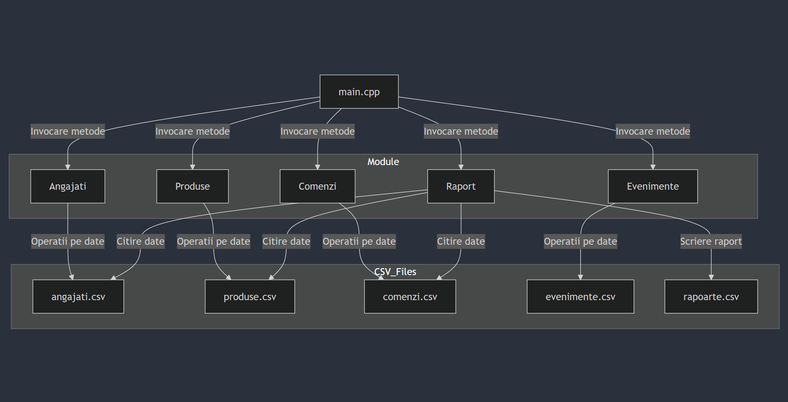

# 📚 Proiect Laborator POO: Călătoria Cafelei în România

Această aplicație gestionează o rețea de cafenele din România, acoperind funcționalități precum organizarea personalului, gestionarea stocurilor, înregistrarea comenzilor, planificarea evenimentelor speciale și generarea rapoartelor zilnice.

---

## 📝 Funcționalități Implementate

1. **Gestionarea Angajaților**:
   - Creare, ștergere și modificare ture pentru angajați.
   - Clase dedicate pentru Barista, Manager și Ospătar, utilizând moștenire și polimorfism.

2. **Gestionarea Stocurilor**:
   - Adăugare, ștergere și modificare produse.
   - Calcularea stocurilor rămase după fiecare comandă.

3. **Gestionarea Comenzilor**:
   - Înregistrarea comenzilor plasate de clienți.
   - Calcularea prețului total al comenzilor.
   - Actualizarea automată a stocurilor.

4. **Planificarea Evenimentelor**:
   - Organizare și ștergere evenimente.
   - Calcularea costurilor totale pentru evenimentele organizate.

5. **Generarea Rapoartelor**:
   - Rapoarte zilnice pentru veniturile totale, costurile produselor și salariile angajaților.
   - Calcularea profitului zilnic.

6. **Import și Export CSV**:
   - Manipularea fișierelor CSV pentru stocuri, angajați, comenzi, evenimente și rapoarte.

---

## 🛠️ Concepte OOP Utilizate

- **Clase și Obiecte**: Structurare clară pentru fiecare modul.
- **Constructori și Destructori**: Inițializare și curățare automată a resurselor.
- **Încapsulare**: Atribute private, accesibile doar prin metode specifice.
- **Moștenire**: Clase derivate (Barista, Manager, Ospătar) din clasa de bază Angajat.
- **Polimorfism**: Calcularea salariilor utilizând metode virtuale.
- **Abstractizare**: Funcționalități generale implementate în clase abstracte.
- **Templates**: Flexibilitate în gestionarea datelor CSV.
- **Exceptions**: Tratarea erorilor pentru fișiere și date invalide.
- **Design Patterns**: Singleton pentru gestionarea resurselor comune.

---

## 📂 Structura Fișierelor CSV

1. **Angajați**: 
   - `Nume, Funcție, OraInceput, OraSfarsit`
2. **Produse**:
   - `NumeProdus, Tip, Pret, Cantitate`
3. **Comenzi**:
   - `NumeClient, Produs, Cantitate, PretTotal`
4. **Evenimente**:
   - `NumeEveniment, Data, Locatie, Cost`
5. **Rapoarte**:
   - `Data, VenituriTotale, CosturiProduse, SalariiAngajati, ProfitNet`

---

## 💻 Cerințe de Sistem

- **Compilator C++**: Recomandat g++.
- **Directorul `data`**: Trebuie să conțină fișierele CSV pentru inițializare.

---

## 🚀 Instrucțiuni de Rulare

### Utilizând `g++`
1. **Compilați codul**:
   ```bash
   g++ -o cafenele Angajati/Angajat.cpp Comenzi/Comanda.cpp Produse/Produs.cpp CSV/CsvHandler.cpp main.cpp Raport/Raport.cpp Evenimente/Eveniment.cpp
   ```
   ```bash
   ./cafenele
   ```
2.**Makefile**:
   ```bash
   make
   ```
   ```bash
   ./cafenele
   ```

[Matrice de Testare - Excel](DATA/Matrice_de_Testare.xlsx)

